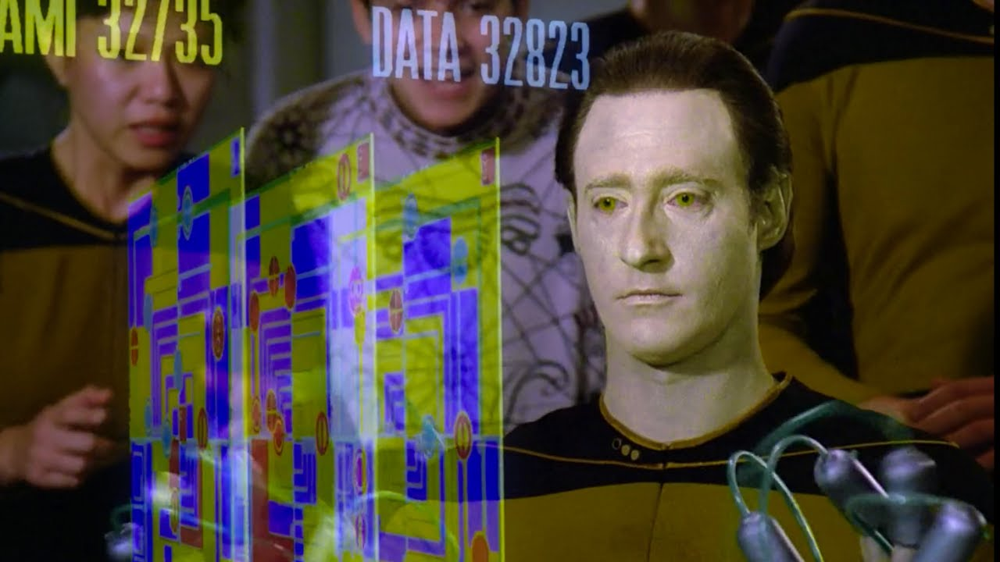

# Stratagema

## Challenge 1

This challenge will help you get familiar with **agents**, **states**, and **actions** in search problems.  You will complete the program so that the computer wins the game playing randomly. 

This assignment is titled with affection toward *Star Trek: TNG*. Game play is sort of loosely comparable. 

## Grading

Two receive a **satisfactory** grade on this assignment you must:

- Pass X/X Gatorchecks
- Answer 2/3 mystery questions correctly during the lab section following the deadline

> [!IMPORTANT]
>
>  **It's a good idea to review your assignment right before lab.** You must answer mystery questions verbally during lab time in order to receive credit for this assignment, without looking at your repo. You will answer these questions one-on-one with a professor or TL.

Learn more about grading in [the syllabus](https://github.com/allegheny-college-cmpsc-303-fall-2024/course-materials?tab=readme-ov-file#grading-scheme). 

## Course Learning Outcomes

This assignment builds toward CLO #1 (implementing an intelligent agent) and CLO #2 (applying search algorithms). You can read more about CLOs [here](https://github.com/allegheny-college-cmpsc-303-fall-2024/course-materials/blob/main/README.md#course-learning-outcomes). 

## Explanation

:w

TODO: inlcude env no env options

TODO: explain deep_copy and set

part 1: neighbors, moves, terminal, diagonal

part 2: compare random, dfs, and bfs

- finish solve function
- create solution list for dfs, bfs, and random
- output path cost AND time to solution for each 
- output a png that compares the three